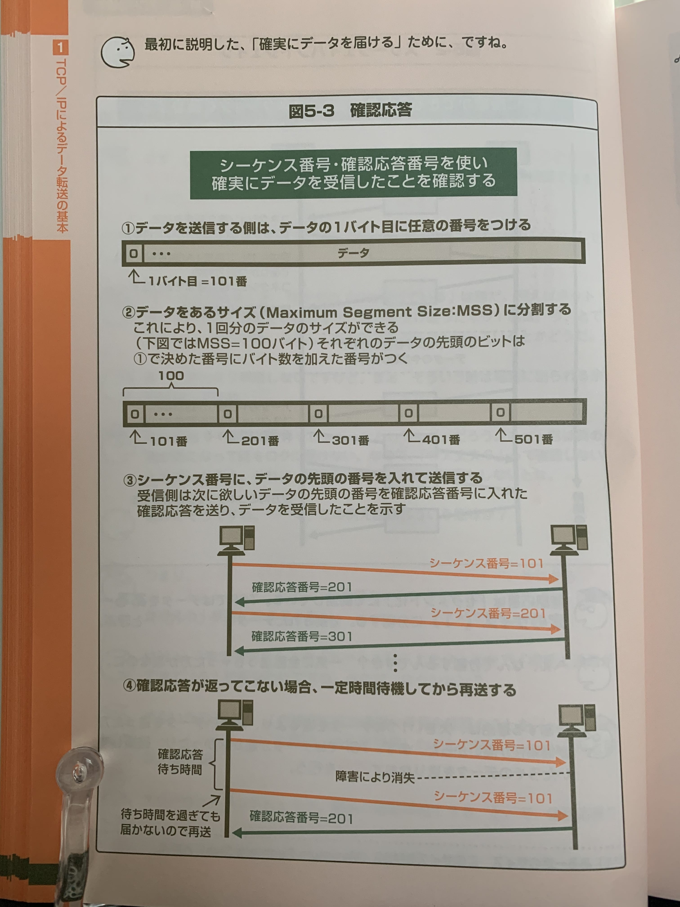

# ３分間 DNS 基礎講座

## カプセル化

通信を行うための制御データを付加していくこと

この制御データをヘッダと呼ぶ

## IP アドレス

ネットワーク部とホスト部から成る。2 つを合わせると 32 ビットになる。

８ビット毎に区切りを入れている

大きいネットワークではネットワーク部が小さく、ホスト部が大きくなる。小さいネットワークではその逆。

## サブネットマスク

ネットワーク部のビットを 0。ホスト部のビットを 0 にした 32 ビットの値。


ホスト部が全て０のアドレスは、ネットワークを示すネットワークアドレス

## コネクション

事前に通信できることを確認する

### コネクションの確立

データの要求側と、提供側で、通信を行う準備ができたことを確認できたこと

### コネクション確立時に TCP のヘッダに付与されるフラグ

- SYK: コネクション確立要求
- ACK: 要求に対しての応答

### 確認応答

受信したことの確認

### シーケンス番号と確認応答



受信側が次に欲しいセグメントを通知する

## ウィンドウ制御

データを送るたびに確認応答を待っていたのでは、時間がかかってしまう。そのため、相手が受け取れるデータ量を教えてもらい、その分だけ一気に送る、と言う方式をとる。このデータ量のことを**ウィンドウサイズ**とよぶ

## フロー制御

## ドメインネーム

### レジストリ

ドメイン名を登録する組織
根の直下のドメイン、jp ドメインなどに一つずつ存在する

- 例えば、日本レジストリサービスは「.jp」のドメイン名レジストリであり、「.jp」でおわるドメイン名の登録・管理を行なっている組織

### レジストラ

レジストリの委託を受けた業者。
ドメイン名の登録業務を行う

### ccTLD と gTLD

トップレベルドメイン(TLD)には２種類ある。

- ccTLD
  - 国別の TLD。日本の jp やドイツの de など
- gLTD
  - 国の関係なく使用できる TLD。com, net,org など

### セカンドレベルドメイン(SLD)の有無

- 汎用 jp ドメイン（SLD なし）
  - 日本にある個人、企業なら制限なしで取得可能。gihyo.jp など

```md
(名前).jp.
```

- 属性型 jp ドメイン
  - SLD として組織の属性がつく
  - 属性に合った組織でないと取れない、１組織につき 1 つまで。gihyo.co.jp など

```md
(名前).(属性).jp.
```

### FQDN

根から全てのドメイン名を記述するドメイン名のこと

```md
gihyo.jp
ではなく
gihyo.jp.
として、最後にドットをつける。これは根のドメイン名を表す。
```

## DNS の構造

### ネームサーバー

- ドメイン名と IP アドレスの対応データベースを持つサーバーのこと。
- ネームサーバーはドメインごとに存在する(jp ドメインとか、ac ドメインとか)
- 各ネームサーバーは自分の直下のドメインしか管理しない。jp ドメインであれば、ac.jp や co.jp までしか管理しない
- この管理する範囲のことを**ゾーン**という。ネームサーバーが管理する、ドメイン直下の名前たちの範囲。

### A レコード

A レコードとは: **「名前」に対応する IP アドレスを記述するのが A レコード**

- 「名前」にはホスト名。
- 「RDATA」には、「名前」に書かれたホストに対応する IP アドレスを保持している

### CNAME レコード

CNAME レコードとは: **1 つの機器に別の名前をつけるときに利用する**

- 「名前」には別名
- RDATA には「本当の名前」を入れる

### NS レコード

NS レコードとは: **ネームサーバーを指定するレコード**

- 「名前」にはドメイン名。
- 「RDATA」には、ネームサーバーの名前。
