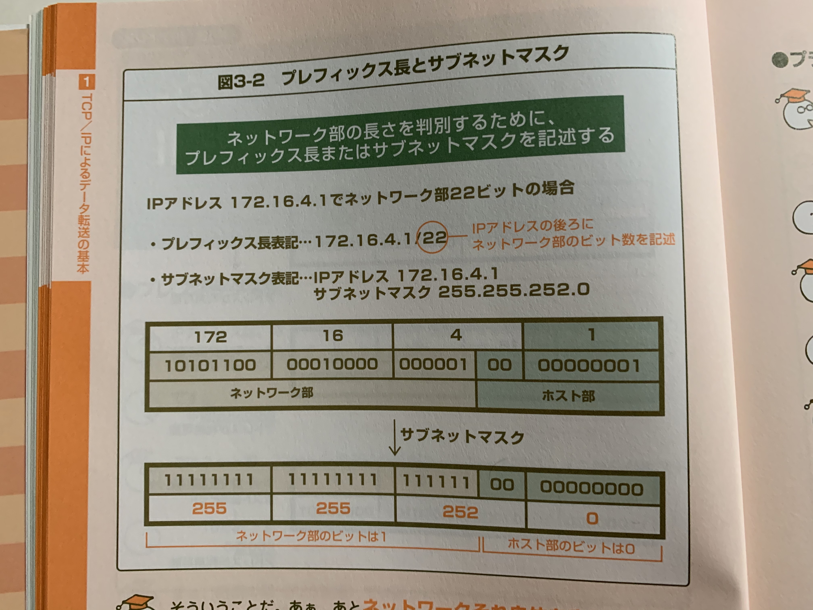

# ３分間 DNS 基礎講座

## カプセル化

通信を行うための制御データを付加していくこと

この制御データをヘッダと呼ぶ

## IP アドレス

ネットワーク部とホスト部から成る。2 つを合わせると 32 ビットになる。

８ビット毎に区切りを入れている

大きいネットワークではネットワーク部が小さく、ホスト部が大きくなる。小さいネットワークではその逆。

## サブネットマスク

ネットワーク部のビットを 0。ホスト部のビットを 0 にした 32 ビットの値。

ホスト部が全て０のアドレスは、ネットワークを示すネットワークアドレス

## コネクション

事前に通信できることを確認する

### コネクションの確立

データの要求側と、提供側で、通信を行う準備ができたことを確認できたこと

### コネクション確立時に TCP のヘッダに付与されるフラグ

- SYK: コネクション確立要求
- ACK: 要求に対しての応答

### 確認応答

受信したことの確認

### シーケンス番号と確認応答

受信側が次に欲しいセグメントを通知する

## ウィンドウ制御

データを送るたびに確認応答を待っていたのでは、時間がかかってしまう。そのため、相手が受け取れるデータ量を教えてもらい、その分だけ一気に送る、と言う方式をとる。このデータ量のことを**ウィンドウサイズ**とよぶ

## フロー制御
